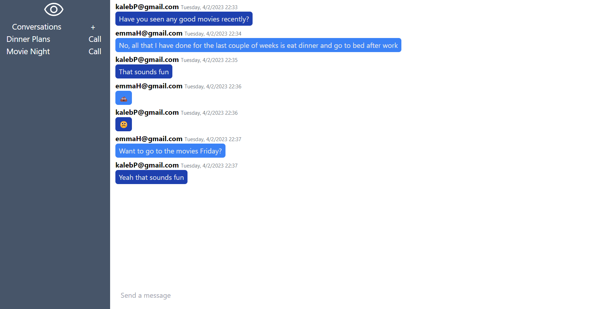

# iris
A chat app built with sveltekit, go, and MySQL. Currently supports persistent messaging between an arbitrary number of users and audio calls between two users over voip.  This was built as my senior capstone project to be a self hostable communications platform to allow people to stay in contact. The frontend is built using svelte and sveltekit with messaging being implemented through web workers, and audio calls being implemented through websockets. The backend uses the gorilla web kit through gorilla/mux and gorilla/websocket. The application uses a MCV architecture as a general architecture. The backend is built in a hexagonal architecture.

## Sveltekit 
    Development mode listens on port 5173. Production build listens on 3000 by default but can be changed by assigning PORT=YourDesiredPort. Iris is set to build for a node production server. Building can be done with `npm run build` to create the build directory and `node build` to run the production build.

## Go 
    The go server listens to port 4444 by default but can be configured by command line flags.

## MySQL 
    The docker image can be built with port forwarding to any port, but the server is set to listen on 3306 and will need to be changed with a flag at server start time.
    

